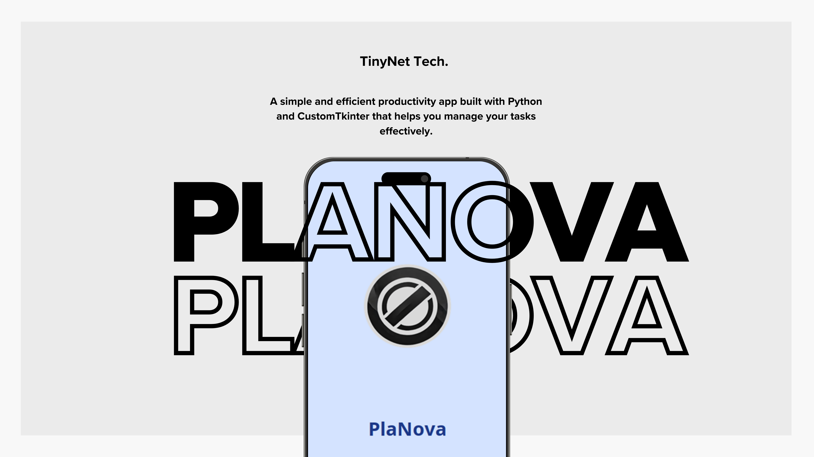
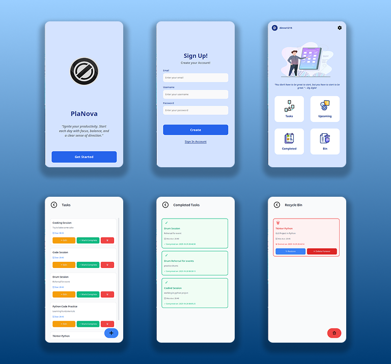

# PlaNova

A simple and efficient productivity app built with Python and CustomTkinter that helps you manage your tasks effectively.

## Features

- ✅ **Create Tasks** - Add new tasks to your to-do list
- 📅 **Upcoming Tasks** - Schedule and view upcoming tasks
- ✔️ **Mark Complete** - Track completed tasks
- 🗑️ **Trash Bin** - Deleted tasks are stored in a separate window
- ♻️ **Restore Tasks** - Recover tasks from the trash bin
- 🗂️ **Organized View** - Separate windows for active and deleted tasks

## Screenshots




## Prerequisites

- Python 3.7 or higher
- pip (Python package manager)

## Installation

1. **Clone the repository**
   ```bash
   git clone https://github.com/yourusername/PlaNova.git
   cd PlaNova
   ```

2. **Create a virtual environment**
   ```bash
   python -m venv venv
   ```

3. **Activate the virtual environment**
   
   - **Windows:**
     ```bash
     venv\Scripts\activate
     ```
   
   - **Linux/Mac:**
     ```bash
     source venv/bin/activate
     ```

4. **Install dependencies**
   ```bash
   pip install customtkinter pillow watchdog
   ```

## Usage

### Running the Application

```bash
python main.py
```

### Development Mode (with Hot Reload)

For developers who want to work on the project with automatic reloading:

```bash
python dev_runner.py
```

> ⚠️ **Note for Windows Users:**  
> When running PlaNova on Windows, some UI elements may appear misaligned or clipped due to a known CustomTkinter rendering issue. This bug does not affect functionality and will be addressed in a future update.


## Dependencies

- **customtkinter** - Modern UI framework for Python
- **pillow** - Image processing library
- **watchdog** - File system monitoring (for hot reload in development)

## Project Structure

```
PlaNova/
├── main.py                       # Main application entry point
│
├── core/
│   ├── __init__.py
│   └── app.py                    # Core application logic
│                     
├── assets/
│   ├── icons/                    # Application icons
│   └── images/                   # Images and graphics
│            
├── components/
│   ├── __init__.py
│   ├── appbar.py                 # Top navigation bar component
│   └── button.py                 # Custom button components
│
├── pages/
│   ├── __init__.py
│   ├── bin.py                    # Recycle bin page
│   ├── completed.py              # Completed tasks page
│   ├── dashboard.py              # Main dashboard
│   ├── login.py                  # Login page
│   ├── register.py               # Registration page
│   ├── settings.py               # Settings/preferences page
│   ├── tasks.py                  # Active tasks page
│   ├── upcoming.py               # Upcoming tasks page
│   └── welcome.py                # Welcome/landing page
│
├── data/
│   └── preferences.json          # Users Data
│
├── dev_runner.py                 # Development runner with hot reload
├── venv/                         # Virtual environment (not in git)
└── README.md                     # Project documentation
```

## Author

- GitHub: [@Lynxguerba](https://github.com/Lynxguerba)

## Acknowledgments

- Built with [CustomTkinter](https://github.com/TomSchimansky/CustomTkinter)
- Icons and images processed with Pillow

---

⭐ If you find this project helpful, please consider giving it a star!
